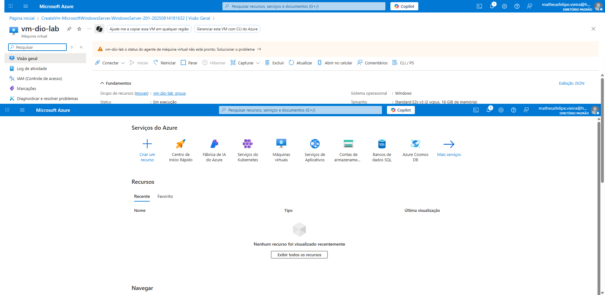
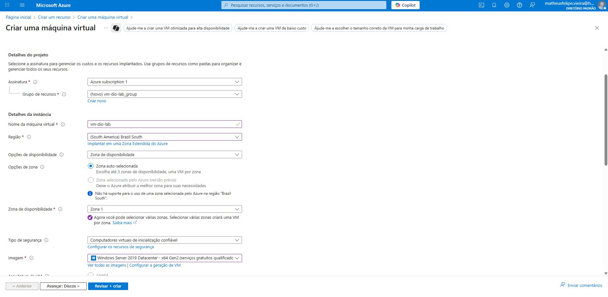
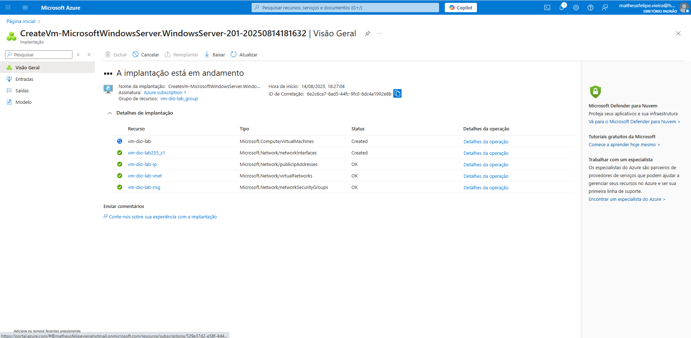
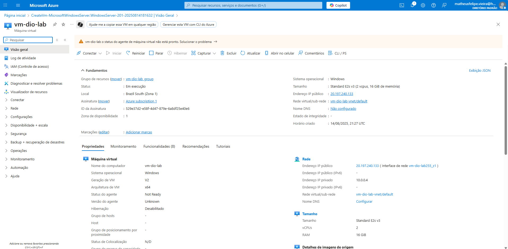

# Criando Máquinas Virtuais na Azure

## 📌 Objetivo
Este projeto foi desenvolvido como parte do **Desafio da DIO** para aplicar, de forma prática, os conhecimentos sobre **criação e configuração de Máquinas Virtuais na Azure**.  
O foco foi entender o processo de provisionamento de recursos na nuvem, testar a conectividade e documentar toda a experiência.

---

## 🖥️ Passo a Passo

### 1️⃣ Acessar o Portal do Azure
- Entrar em: [https://portal.azure.com](https://portal.azure.com)  
- Fazer login com a conta associada ao Azure.

### 2️⃣ Criar um novo recurso
- Clique em **"Criar um recurso"** → **"Máquina Virtual"**.

### 3️⃣ Configurar a Máquina Virtual
- **Nome da VM:** `vm-dio-lab`  
- **Região:** Brazil South  
- **Sistema Operacional:** Windows Server 2019 Datacenter  
- **Tamanho:** Standard_B1s (econômico para testes)  
- **Usuário:** `adminazure`  
- **Autenticação:** Senha segura

### 4️⃣ Configurações de Rede
- Habilitar a porta **RDP (3389)** para conexões remotas.

### 5️⃣ Revisar e Criar
- Conferir as configurações e clicar em **"Criar"**.

### 6️⃣ Conectar à VM
- Após a implantação, abrir o recurso criado e clicar em **"Conectar"** via RDP.  
- Usar as credenciais definidas na criação.

---

## 📷 Capturas de Tela

### 1️⃣ Acessando o Portal Azure

### 2️⃣ Criando a Máquina Virtual

### 3️⃣ Implantação da VM

### 4️⃣ VM em execução

---

## 📚 Aprendizados

Durante o desafio, pude:
- Criar e configurar uma **Máquina Virtual** no Azure do zero.
- Entender a importância da escolha correta de **região** e **tamanho da VM** para desempenho e custo.
- Aprender a **habilitar portas de rede** e configurar acesso remoto com segurança.
- Experimentar a **conexão via RDP** para administração da máquina.

---

## 🔗 Referências
- [Documentação Oficial - Criar uma VM Windows no Azure](https://learn.microsoft.com/pt-br/azure/virtual-machines/windows/quick-create-portal)
- [Portal do Azure](https://portal.azure.com)

